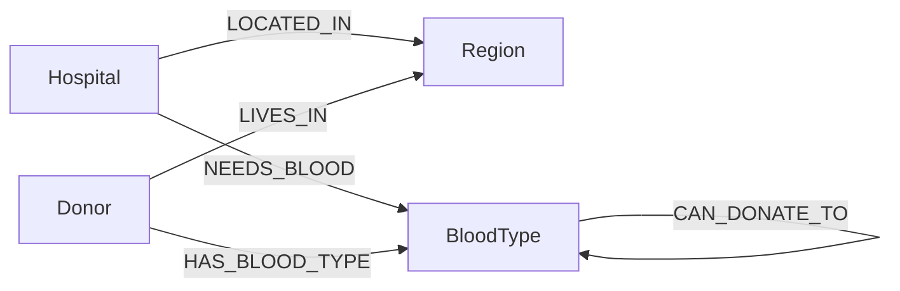

# Blood-Link Emergency Network

Blood-Link Emergency Network is a Neo4j-powered blood donor matching application built for emergency hospital search use cases.
It combines a small Node.js/Express backend with a browser UI to find compatible donors in the same region as a selected hospital.

## Use Case

The project is designed for emergency situations where a hospital needs to quickly identify nearby compatible blood donors.

Typical flow:

1. A hospital selects the blood type it urgently needs.
2. The backend updates the graph to reflect that hospital's current blood requirement.
3. The system searches for donors who are compatible, available, and located in the same region.
4. The frontend displays the best matches with contact details.

This makes the app useful for:

- emergency donor outreach
- hospital blood request coordination
- graph database demonstrations
- academic assignments on Neo4j modeling

## Why a Graph Database?

A graph database fits this problem well because the core data is relationship-heavy.

Instead of joining many tables, the application can traverse direct relationships such as:

- `Hospital` `LOCATED_IN` `Region`
- `Donor` `LIVES_IN` `Region`
- `Donor` `HAS_BLOOD_TYPE` `BloodType`
- `BloodType` `CAN_DONATE_TO` `BloodType`
- `Hospital` `NEEDS_BLOOD` `BloodType`

This gives a few practical advantages:

- fast relationship traversal for compatibility matching
- simpler modeling of medical and geographic connections
- easier expansion if more donor rules are added later
- more natural fit for multi-hop queries such as "hospital -> region -> compatible donors"

## Data Model

The project uses four core node types and a small set of relationships.



### Nodes

- `Hospital` - emergency request source
- `Region` - geographic area used for local matching
- `Donor` - person who may donate blood
- `BloodType` - ABO and Rh blood group node

### Relationships

- `LOCATED_IN` - links a hospital to its region
- `LIVES_IN` - links a donor to a region
- `HAS_BLOOD_TYPE` - links a donor to their blood type
- `NEEDS_BLOOD` - links a hospital to the blood type it needs
- `CAN_DONATE_TO` - stores blood compatibility rules between blood types

## Features

- Select a hospital and required blood type in the UI
- Dynamically update the emergency need in Neo4j
- Find compatible donors in the same region
- Filter by donor availability
- Apply a 90-day donation cooldown rule
- Show donor phone number and last donation date

## Tech Stack

- Frontend: HTML, Tailwind CSS, Vanilla JavaScript
- Backend: Node.js, Express
- Database: Neo4j
- Config: `dotenv`

## Setup and Run

### 1. Create the CognoDB / Neo4j Instance

Create or open your CognoDB instance and note the connection details:

- database URI
- database password
- default username `cognodb`

If your instance provides a connection panel, copy the Neo4j URI from there and keep the password safe.

### 2. Configure Environment Variables

Create a `.env` file in the project root:

```env
COGNO_URI=neo4j://your-instance-host:7687
COGNO_PASSWORD=your-password
PORT=3000
```

### 3. Install Dependencies

```bash
npm install
```

### 4. Load Sample Data

Run the seed script to clear the database and insert sample hospitals, regions, blood types, and 100 dummy donors.

```bash
node seed.js
```

### 5. Start the Backend

```bash
node server.js
```

The API will run on:

```text
http://localhost:3000
```

### 6. Open the UI

Open `index.html` in a browser and make sure the backend is running.

## Main Queries Explained

The backend exposes one main API route: `POST /api/emergency-donors`.

### 1. Update the hospital's current blood need

The first query removes any previous `NEEDS_BLOOD` relationship and creates the new one:

```cypher
MATCH (h:Hospital {name: $hospitalName})
OPTIONAL MATCH (h)-[oldRel:NEEDS_BLOOD]->()
DELETE oldRel
WITH h
MATCH (b:BloodType {type: $bloodType})
MERGE (h)-[:NEEDS_BLOOD]->(b)
```

What it does:

- finds the selected hospital
- removes the old emergency need
- connects the hospital to the newly requested blood type

### 2. Find compatible donors

The second query searches the graph for donors matching the hospital's region and the blood compatibility rules:

```cypher
MATCH (h:Hospital {name: $hospitalName})-[:LOCATED_IN]->(r:Region)
MATCH (h)-[:NEEDS_BLOOD]->(targetType:BloodType)
MATCH (targetType)<-[:CAN_DONATE_TO]-(compatibleType:BloodType)
MATCH (d:Donor {is_available: true})-[:HAS_BLOOD_TYPE]->(compatibleType)
MATCH (d)-[:LIVES_IN]->(r)
WHERE d.last_donated_date IS NULL
   OR duration.inDays(date(d.last_donated_date), date()).days > 90
```

What it does:

- limits matches to the same region as the hospital
- finds blood groups that can donate to the requested blood type
- keeps only available donors
- excludes donors who donated within the last 90 days

### 3. Rank donor matches

The query assigns a priority so closer blood matches appear first:

- exact blood group match
- universal donor options such as `O-`
- other compatible types after that

This helps the UI show the most relevant donors near the top.

## Blood Compatibility

The seed script creates `CAN_DONATE_TO` relationships for common blood compatibility rules.

Examples:

- `O-` can donate to all blood types
- `AB+` can receive from all compatible types
- negative blood types only donate to compatible negative and positive recipients as defined by the graph

## API

### `POST /api/emergency-donors`

Request body:

```json
{
  "hospitalName": "Kottayam General Hospital",
  "bloodType": "A+"
}
```

Response includes:

- hospital name
- requested blood type
- donor count
- donor list

## Project Structure

- `index.html` - frontend UI
- `server.js` - Express API and Neo4j donor search
- `seed.js` - sample data loader
- `.env` - Neo4j connection settings

## Notes

- The frontend currently calls the backend at `http://localhost:3000`.
- The seed script deletes existing graph data before inserting sample records.
- Donor phone numbers and donation dates are generated as dummy data for demonstration.

